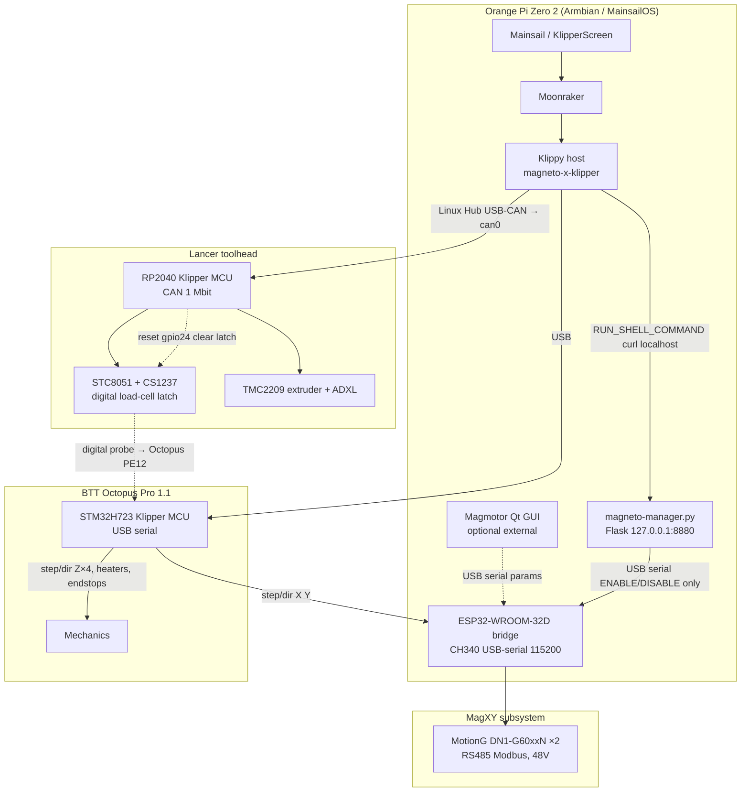
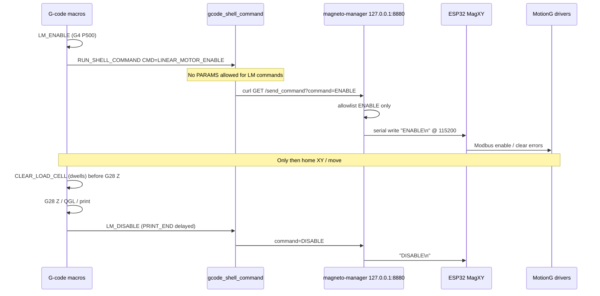
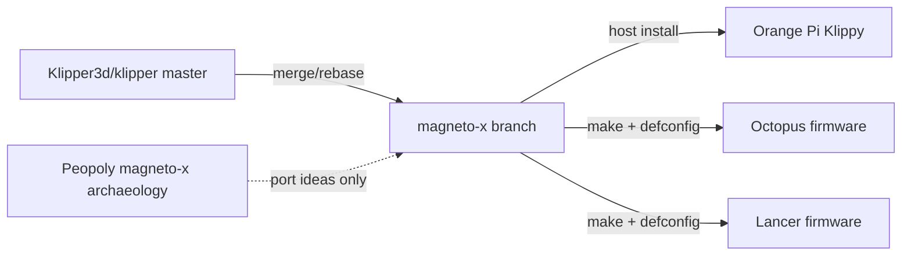
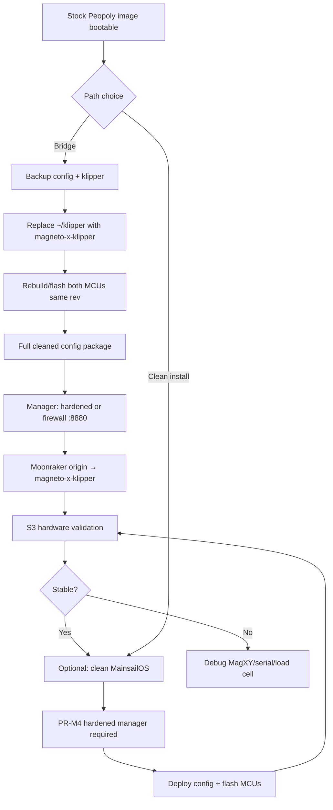

# Design: Peopoly Magneto X Community Modernization

| Field | Value |
|-------|--------|
| **Document** | Magneto X stack modernization (magneto-x / magneto-x-klipper) |
| **Author** | lmambr2 (community magneto-x project) |
| **Date** | 2026-07-11 |
| **Status** | Draft (rev 2 — post design review) |
| **Repos** | [lmambr2/magneto-x](https://github.com/lmambr2/magneto-x), [lmambr2/magneto-x-klipper](https://github.com/lmambr2/magneto-x-klipper) |
| **Local workspace** | `/home/lane/Projects/magneto-x/` |
| **Audience** | Senior engineers / advanced Magneto X owners contributing to the community fork |

---

## Overview

The Peopoly Magneto X never worked reliably for many owners because Peopoly forked Klipper from a May-2023 (v0.11-era) base, published a history-broken squashed `master`, and never kept pace with modern Klipper (~1300 commits behind as of mid-2026). The machine itself is not exotic from Klipper’s point of view: MagXY linear motors appear as ordinary step/dir axes, and the Lancer toolhead is a standard RP2040 CAN MCU. The real deltas are small (~172 lines in Peopoly’s tree) plus host-side services for an ESP32 bridge.

This project modernizes the full stack by:

1. Running **current upstream Klipper** plus **minimal, clearly marked Magneto extras** on branch `magneto-x` of `magneto-x-klipper`.
2. Shipping a **parse-ready** cleaned printer config package and Orange Pi Zero 2 host tooling in the umbrella `magneto-x` repo.
3. Preferring a current MainsailOS/Armbian host image over Peopoly’s frozen 2024 image long-term.
4. **Never** opening PRs or pushing Magneto-specific patches to [Klipper3d/klipper](https://github.com/Klipper3d/klipper).

**Revision 2** closes blocking gaps called out in design review: full Octopus menuconfig (including **25 MHz crystal**), deployable config package (ship `mainsail.cfg`), hardened magneto-manager acceptance criteria, explicit homing soft-fail algorithm, PR exit criteria, and provisional answers for blocking open questions.

---

## Background & Motivation

### Current state

| Layer | Stock Peopoly | Pain |
|-------|---------------|------|
| Klipper host/MCU | Fork of `5f0d252b` (2023-05-25) | Missing years of bugfixes, H7/RP2040 improvements, load_cell ADC path, probe APIs |
| Git history | Public `master` is squash `8dc303bd` (2024-02-10) | Cannot merge/rebase cleanly; archaeology requires branch `magneto-x` |
| Configs | Official release configs **and** OS-update macros | Dual trees: official `magneto-x-klipper-config` has **both** `LINEAR_*` and typo `LINER_*` blocks; OS-update macros primarily use broken `LINER_*` and can break `LM_ENABLE`. Duplicate `PAUSE`/`RESUME`; weak LC28/LM ordering |
| Host OS | `magneto-x-mainsailOS-2024-*-v1.0.9` … `v1.1.1` (+ updates ~v1.1.3) | Frozen packages, ancient Klipper, opaque update path |
| MagXY | ESP32 + MotionG DN1-G60xxN closed-loop | Outside Klipper; depends on Flask `magneto-manager` :8880 |
| Load cell | STC8051 + CS1237 **digital latch** | Not compatible with upstream `load_cell` / `load_cell_probe` (HX71x/ADS ADC path) without hardware change |

### Peopoly’s real Klipper delta (archaeology)

Base commit: `5f0d252b408ef0cd182367ba4cc224b8d105f0ec` (Kevin O'Connor, 2023-05-25).

Usable Peopoly branch: `mypeopoly/Klipper` → `magneto-x` (not squashed `master`):

1. `c8d2e754` — add magneto-x modified files (2024-02-16)
2. `78c3e29a` — remove stepper event full shutdown (2024-04-03)

Verified: `5f0d252b..78c3e29a` → **6 files, 172 insertions, 5 deletions**.

| Path | Change | Why |
|------|--------|-----|
| `klippy/extras/magneto_load_cell.py` | **New** | Pulse GPIO to reset STC8051+CS1237 digital probe latch (`LC28` / `LL28` / `LH28`) |
| `klippy/extras/gcode_shell_command.py` | **New** (Arksine) | Shell from gcode — MagXY ENABLE/DISABLE via HTTP |
| `klippy/extras/homing.py` | Soften “Probe triggered prior to movement” | Sticky load-cell high until reset (Peopoly soft-failed **unconditionally**) |
| `klippy/extras/probe.py` | Minor / mostly dead | Looked up load cell; clear path largely commented |
| `src/stepper.c` | Disable `shutdown("Stepper too far in past")` | MagXY short pulses + ESP32 bridge timing (Peopoly: unconditional) |
| `README.md` | Marketing | — |

**There is no custom kinematics, no MagXY closed-loop math in Klipper, and no linear-motor driver in Klipper.** X/Y use `rotation_distance: 3.2`, `step_pulse_duration: 0.0000002` (verified in `config/printer.cfg`).

### Community prior art (already inventoried)

| Source | Value |
|--------|--------|
| [EmperorArthur/magneto_x_linear_motor_controller_firmware](https://github.com/EmperorArthur/magneto_x_linear_motor_controller_firmware) | ESP32 / Modbus reverse engineering; ENABLE/DISABLE/RTU modes; error tables |
| [kaihanga FAQ](https://kaihanga.github.io/peopoly-magnetox-faq/) | Pause/resume, SSH, Beacon, nginx timeouts |
| [hazyavocado/Peopoly-MagnetoX-CFG](https://github.com/hazyavocado/Peopoly-MagnetoX-CFG) | Pause/resume + client.cfg fixes |
| [PlazmaZero/MagnetoX-OriginMove](https://github.com/PlazmaZero/MagnetoX-OriginMove) | XY origin / port swap without rewiring |
| [Schmudus/My-Magneto-X](https://github.com/Schmudus/My-Magneto-X) | Heavy hardware path (Pi + Kalico + Eddy, etc.) |
| mitant / WilliamJamieson config backups | Field-tested user configs |

### Motivation

Owners who want a maintainable machine should not be stuck on a 2023 Klipper snapshot. The port is small enough that a modern fork plus cleaned configs and documented host services is the highest-leverage path—without rewriting MotionG closed-loop control inside Klipper.

---

## Goals & Non-Goals

### Goals

1. **Modern Klipper** with only the minimum Magneto-specific extras, clearly marked and documented.
2. **Parse-ready printer configs** and Orange Pi Zero 2 host tooling that actually arm MagXY and home Z reliably on a fresh install.
3. **Discoverability**: repo names `magneto-x` and `magneto-x-klipper`; GitHub topics/descriptions per `docs/NAMING.md`.
4. **Upstream hygiene**: never PR or push Magneto-specific patches to `Klipper3d/klipper`.
5. **Incremental modernization**: host OS, MCU firmware, configs, MagXY enable path, optional later ESP32/load-cell improvements.
6. **Migration path** from stock Peopoly image without requiring hardware swaps.
7. **Security-conscious** host surface for `gcode_shell_command` and `magneto-manager` with testable acceptance criteria.

### Non-Goals

- Reimplementing MotionG DN1-G60xxN closed-loop control inside Klipper.
- Replacing the digital load-cell latch with upstream `load_cell_probe` without a hardware redesign.
- Shipping a full custom OS image in the first releases (document + scripts first; image automation later).
- Supporting arbitrary hardware swaps (Pi + Beacon + EBB36) as first-class products—document as alternatives only.
- Affiliation with Peopoly or claiming official support.
- Force-merging Peopoly’s squashed `master` history into our fork.
- Redistributing proprietary Magmotor / MagnetoWifiHelper binaries in the public repo (see D13).

---

## Key Decisions

| # | Decision | Rationale |
|---|----------|-----------|
| D1 | **Two-repo layout**: `magneto-x` (umbrella) + `magneto-x-klipper` (fork, default branch `magneto-x`) | Separates machine docs/config/OS from the large Klipper tree; keeps discoverable names without impersonating Peopoly. |
| D2 | **Rebase/port extras onto current upstream; do not merge Peopoly history** | Peopoly `master` is a squash; their `magneto-x` is ~1300 commits stale. Porting ~4 functional files is cheaper and cleaner than history reconstruction. |
| D3 | **Keep MagXY outside Klipper** (ESP32 + magneto-manager) | Motors are closed-loop at the driver; Klipper only emits step/dir. Reimplementing Modbus RTU control is out of scope for reliability of first ship. |
| D4 | **Keep `magneto_load_cell` separate from upstream `load_cell`** | Electrical interface is a digital latch (STC8051+CS1237), not HX71x/ADS ADC. Using the wrong module would mislead users and cannot work without rewiring. |
| D5 | **Retain `gcode_shell_command` (fork-only) for v1** | MagXY ENABLE/DISABLE currently goes macros → shell → curl → :8880. Native module / Moonraker proxy are future options (A5/A8). |
| D6 | **`MAGNETO_RELAX_STEPPER_PAST` is Kconfig, default off; documented for Octopus MagXY step/dir only — not board-locked in Kconfig** | Unlike Peopoly’s unconditional disable, opt-in preserves upstream safety. Kconfig only `depends on LOW_LEVEL_OPTIONS` (no `MACH_STM32H723` lock — locking would break valid cross-board experiments and H732 package naming). **Enforcement = Octopus defconfig + CI assert Lancer defconfig has `=n` + docs.** See also D15 (enable only after A/B reproduction). |
| D7 | **Sticky-probe policy: auto_clear + clear-with-dwell in gcode + one soft retry then hard fail** | Soft-fail-when-module-present alone can accept a bad first sample. Required algorithm (see §4): on “triggered prior,” if `magneto_load_cell` loaded → clear latch, dwell, **one** retry of the probe move; if still no movement → **hard** `command_error`. Closes former OQ#5. |
| D8 | **Host OS: current MainsailOS Armbian for Orange Pi Zero 2 (preferred)** | Stock 2024 image is a bridge only; frozen packages and ancient Klipper are the long-term problem. |
| D9 | **Never contribute Magneto patches upstream** | `gcode_shell_command` is intentionally rejected by Klipper3d (security); MagXY/load-cell latch are machine-specific. |
| D10 | **Config fixes are first-class**: `LINEAR_*` only, single PAUSE/RESUME, `LM_ENABLE` + `CLEAR_LOAD_CELL` before motion/Z; package must be parse-ready | Stock dual trees and missing includes make machines appear broken. |
| D21 | **v1 path = clean OS after hardened manager (1B)**; stock image is bridge/recovery only | Operator lock 2026-07-11. PR-M4 before public install script. |
| D22 | **MCU flash deferred (2A)**: ship host+config against stock MCU bins first | Lower brick risk; full modern MCU flash is a later gate after S3 motion on stock bins. |
| D23 | **OriginMove is published default XY (3B)**; stock Peopoly XY is alternate include | Matches live lab unit + common field configs. |
| D24 | **Hardened manager before config polish / clean OS (4C)** | PR-M4 next critical path item. |
| D25 | **Equal Kalico A/B support (5)** | Both tracks first-class in docs/CI/support; “start here if unsure” may still name mainline for simpler recovery. |
| D26 | **CAN stock hub: gs_usb `1d50:606f` @ 250 kbit** | Field-measured; close OQ#3 for stock Linux Hub. |
| D11 | **Vendor ESP32 firmware initially; EmperorArthur path optional later** | Reduce variables for first successful modern boot. |
| D12 | **Manager paths parameterized from day one of hardened manager** | Stock manager assumes `/home/pi/...`; modern MainsailOS users may differ. |
| D13 | **Do not redistribute Magmotor / MagnetoWifiHelper binaries in published git** | Proprietary vendor binaries. Install docs say: copy from user-obtained Peopoly `magnetox-os-update` / TF image. Published repo ships only open Python manager source + install scripts. Workspace reference clones stay gitignored. |
| D14 | **Moonraker origin**: prefer `https://github.com/lmambr2/magneto-x-klipper.git` branch `magneto-x`; if GitHub still redirects from old `lmambr2/klipper`, both work until rename is confirmed public | Local workspace already uses `magneto-x-klipper.git`. Docs list primary name; fallback note for redirects. |
| D15 | **Stepper-past relaxation: default n; enable y on Octopus only after S3 A/B reproduces shutdown** | Avoid shipping a safety disable that modern Klipper no longer needs. Recipe documents how to set y; defconfig may ship y **commented** or as a known-good overlay once reproduction notes exist. |
| D16 | **Octopus menuconfig crystal = 25 MHz** (with STM32H723, 128KiB bootloader, USB PA11/PA12) | Matches upstream BTT sample `generic-bigtreetech-octopus-pro-v1.1.cfg`. Wrong crystal → non-booting/flaky MCU. |
| D17 | **Hardened manager is required before any new install path that runs our install script** | Stock manager binds `0.0.0.0`, allows arbitrary serial commands, uses `shell=True`. Bridge on stock Peopoly may keep stock manager only with localhost firewall; clean OS must use hardened manager (PR-M4 before PR-M5 Option A). |
| D18 | **Config package ships Magneto-safe `mainsail.cfg` (no PAUSE/RESUME)** | `printer.cfg` includes it; missing file → Klipper hard fail. Deployable = include graph resolves. |
| D19 | **`gcode_shell_command` PARAMS ignored or rejected for Magneto LM commands; no demo shell commands in deployable config** | PARAMS can append arbitrary argv to curl. Production `shell_command.cfg` is allowlisted commands only. |
| D20 | **Host/MCU pairing: tag releases `magneto-x-vX.Y.Z` on both repos when shipping a tested combo; day-to-day use `git rev-parse --short HEAD` and flash both MCUs from that tree** | Full lockstep semver optional later; operational check is same tree + version strings. |

---

## Proposed Design

### 1. Full-stack architecture



**Power domains (safety-relevant):**

| Supply | Use | Source of claim |
|--------|-----|-----------------|
| 24 V / 350 W | Logic, heaters, Z, toolhead | Project research docs / Peopoly wiki (not re-fetched in rev2 review) |
| 48 V / 600 W | Linear motors only | Same |

**MCU map:**

| Module | SoC | Interface | Firmware |
|--------|-----|-----------|----------|
| Host | Allwinner H616 (OPi Zero 2) | — | Linux + Klippy |
| Main board | STM32H723 family (Octopus Pro 1.1; wiki sometimes says H732 package) | USB | Klipper MCU; optionally `MAGNETO_RELAX_STEPPER_PAST` after A/B |
| Linux Hub PCB | USB-CAN **gs_usb `1d50:606f`** (candleLight-class) | Host `can0` @ **250 kbit** | Kernel `gs_usb` (measured; not 1 Mbit) |
| Toolhead | RP2040 (Lancer) | CAN @ 1 Mbit via Linux Hub | Klipper MCU (no stepper-past option) |
| MagXY bridge | ESP32-WROOM-32D | USB-serial CH340 | Vendor / optional community |
| Load-cell FE | STC8051 + CS1237 | Digital probe to Octopus `PE12`; reset via toolhead `gpio24` | Separate binary; DIP thresholds |
| Linear drivers | MotionG DN1-G60xxN | RS485 ×2 | Closed-loop; Magmotor / LinearMotorHost |

**Default stock SSH:** `pi` / `armbian` (Peopoly image). Modern MainsailOS defaults may differ—document per image release notes.

**Operability footgun:** `[force_move] enable_force_move: True` is present in stock-derived `printer.cfg` for recovery. Treat as **debug-only**; document risk of forced motion with MagXY armed. Prefer leaving enabled for Magneto recovery culture but warn prominently in config comments and FAQ.

### 2. MagXY enable path (critical sequence)



**Stock naming:** shell command names must be **`LINEAR_MOTOR_*`**, not **`LINER_MOTOR_*`**.

**Dual stock trees (provenance):**

| Tree | LINEAR | LINER |
|------|--------|-------|
| Official `mypeopoly/magneto-x-klipper-config` | Present (working names) | **Also present** (typo duplicates) — confusing |
| Peopoly `magnetox-os-update` macros / some community dumps | Often missing or secondary | **Primary broken names** used by `LM_ENABLE` |
| This project `config/` | **Only LINEAR** | **Forbidden** in deployable package |

### 3. Repo layout & contribution policy

#### Published repositories

| Repo | Role | Default branch |
|------|------|----------------|
| [lmambr2/magneto-x](https://github.com/lmambr2/magneto-x) | Umbrella: docs, `config/`, `os/`, research | `main` |
| [lmambr2/magneto-x-klipper](https://github.com/lmambr2/magneto-x-klipper) | Modern Klipper + Magneto extras | **`magneto-x`** (not `master`) |

Local workspace already points `klipper/` origin at `https://github.com/lmambr2/magneto-x-klipper.git` (D14).

#### Local workspace (development)

```
/home/lane/Projects/magneto-x/
├── klipper/                      # clone of magneto-x-klipper @ magneto-x
├── config/                       # deployable printer configs (must be parse-ready)
├── docs/                         # RESEARCH, MODERNIZATION, OS_IMAGE, NAMING
├── os/                           # install scripts, hardened manager source, defconfigs
├── peopoly-klipper/              # reference (gitignored from publish)
├── magnetox-os-update/           # vendor binaries reference (gitignored)
├── magneto-manager-tool/         # vendor manager source reference (gitignored)
├── magneto-x-klipper-config/     # vendor config reference (gitignored)
├── community/                    # FAQ, EmperorArthur, user configs, …
└── scripts/                      # helpers, include-resolution checks
```

Published umbrella content **excludes** large reference clones (`.gitignore`). Proprietary Magmotor binaries must **not** appear in published artifacts (D13).

#### Contribution policy

1. **No PRs to Klipper3d** for Magneto extras.
2. **Magneto patches stay small** and tagged (`Magneto X: …`).
3. **Prefer config/docs/os fixes** in `magneto-x` over deepening the Klipper fork.
4. **Upstream sync** for `magneto-x-klipper`: fetch Klipper3d, merge/rebase into `magneto-x`, re-verify Magneto touch points, never push Magneto commits upstream.
5. **Optional later splits**: `magneto-x-config`, `magneto-x-host` if packages grow.
6. **License**: Klipper GPL-3.0; configs as labeled; Magmotor proprietary — user-obtained only.

### 4. Porting strategy for Klipper extras

#### Already landed (do not re-implement as “new work”)

Branch tip includes:

| Commit | Content |
|--------|---------|
| `449d8583` | Port: `magneto_load_cell`, `gcode_shell_command`, homing soft-fail gate, `MAGNETO_RELAX_STEPPER_PAST`, `docs/Magneto_X.md` |
| `7887d9a0` | Branding as magneto-x-klipper |

| Component | Path | Status |
|-----------|------|--------|
| Load-cell latch | `klippy/extras/magneto_load_cell.py` | Landed; **gaps remain** (dwell in gcode cmd — PR-K2) |
| Shell command | `klippy/extras/gcode_shell_command.py` | Landed; **PARAMS policy** — PR-K5 |
| Homing soft-fail | `klippy/extras/homing.py` | Landed soft-log; **must upgrade to clear+retry+hard** — PR-K3 |
| Stepper past | `src/stepper.c` + `src/Kconfig` | Landed default n; not board-locked — PR-K4 verify + defconfig CI |
| Docs | `docs/Magneto_X.md`, README | Landed; amend crystal + soft-fail policy |



**Sync rules when upstream moves:**

| Touch point | Risk | Mitigation |
|-------------|------|------------|
| `homing.py` `probing_move` | Medium | Keep delta minimal; re-apply D7 algorithm; Z-home test |
| `stepper.c` past check | Low–medium | Kconfig guard; re-find shutdown site |
| New extras modules | Low | Independent files |
| `gcode_shell_command` | Low | Isolated; PARAMS policy |

**Deliberately not ported:** Peopoly `probe.py` dead code; marketing README; unconditional stepper shutdown disable.

#### Critical interfaces

**`[magneto_load_cell]`**

```ini
[magneto_load_cell]
pin: MAG_TOOL:gpio24
pulse_time: 0.4
auto_clear_on_home: True
```

| Behavior | Required |
|----------|----------|
| Idle high; pulse low for `pulse_time` | Yes |
| `auto_clear_on_home` on rails using endstop name `probe` | Yes; dwell `pulse_time + 0.15` after clear |
| `CLEAR_LOAD_CELL` / `LC28` | **Must dwell inside the command** for ≥ `pulse_time` after scheduling edges (PR-K2). Callers must not rely on external `G4` alone, though `homing_override` may still `G4 P500` as belt-and-suspenders. |
| `LL28` / `LH28` | Debug force low/high; document as unsafe during prints |

**Homing sticky-probe algorithm (D7) — implement in PR-K3:**

```
probing_move(..., check_movement=True):
  epos = homing_move(...)
  if not check_movement or check_no_movement() is None:
    return epos
  if printer.lookup_object('magneto_load_cell', None) is None:
    raise "Probe triggered prior to movement"
  # Magneto path:
  load_cell.clear_load_cell()
  toolhead.dwell(pulse_time + 0.15)
  epos = homing_move(...)   # single retry
  if check_no_movement() is not None:
    raise "Probe triggered prior to movement (after load-cell clear retry)"
  gcode.respond_info("Probe was sticky; cleared load cell and retried once")
  return epos
```

This **replaces** the current “log and return epos without retry” behavior, which can accept a bad sample.

**`MAGNETO_RELAX_STEPPER_PAST`**

```c
// When CONFIG_MAGNETO_RELAX_STEPPER_PAST is set, skip:
//   if (diff < (int32_t)-timer_from_us(1000))
//       shutdown("Stepper too far in past");
```

- Default **n**.
- Not board-locked in Kconfig (D6).
- Octopus known-good defconfig may set y **only after** S3 A/B (D15).
- CI: Lancer defconfig must not set y.

**A/B experiment (S3, required before recommending y):**

1. Build Octopus with `MAGNETO_RELAX_STEPPER_PAST=n`.
2. `LM_ENABLE`; home XY; run aggressive travel / `SHAPER_CALIBRATE` / max_accel moves.
3. If `"Stepper too far in past"` appears in MCU shutdown → rebuild with `=y`, retest, document in `docs/Magneto_X.md` with git rev and accel settings.
4. If never trips → leave `=n` in published defconfig; keep Kconfig option for field escapes.

### 5. Config package (`magneto-x` / `config/`)

Deploy target: `~/printer_data/config/`.

**Deployable = include graph resolves + no forbidden patterns.** PR-M2 is not complete until a fresh directory containing only the published package starts Klipper far enough to fail on missing MCU serial (not missing includes).

| File | Role | Deploy? |
|------|------|---------|
| `printer.cfg` | Kinematics, bed, probe, QGL, mesh, steppers, fans, kill, `homing_override` | Yes |
| `mainsail.cfg` | **Must ship (PR-M2)** — Mainsail extras **without** PAUSE/RESUME | Yes |
| `magneto_device.cfg` | MCU serial + CAN UUID placeholders | Yes |
| `magneto_toolhead.cfg` | Load cell, extruder, ADXL, filament buttons | Yes |
| `shell_command.cfg` | **Only** `LINEAR_MOTOR_ENABLE/DISABLE` (+ optional version curl) | Yes |
| `macros.cfg` | PRINT_START/END, PAUSE/RESUME, LM_*, mesh/QGL | Yes |
| `KAMP*` | Adaptive meshing | Yes (optional include) |
| `KlipperScreen.conf` | Minimal screen config | Yes |
| `macros.cfg.stock-v1.1.3` | Archaeology only | **No — do not install** (header: non-deployable; may contain `RM_UPDATE` / resize patterns) |
| `moonraker-update-manager.conf.snippet` | Origin for fork | Yes (document merge into moonraker.conf) |

**Current gap (workspace today):** `printer.cfg` has `[include mainsail.cfg]` but **`mainsail.cfg` is not in `config/`** → hard fail. PR-M2 must add it (D18). Source can be trimmed from MainsailOS / stock image `mainsail.cfg` with PAUSE/RESUME removed.

**Shell surface (deployable only):**

```ini
[gcode_shell_command LINEAR_MOTOR_ENABLE]
command: curl -sG http://127.0.0.1:8880/send_command --data-urlencode command=ENABLE
timeout: 3.
verbose: False

[gcode_shell_command LINEAR_MOTOR_DISABLE]
command: curl -sG http://127.0.0.1:8880/send_command --data-urlencode command=DISABLE
timeout: 3.
verbose: False

# optional:
[gcode_shell_command GET_MIRROR_VERSION]
command: curl -sG http://127.0.0.1:8880/get_os_version
timeout: 2.
verbose: True
```

**Remove from production package:** `hello_world` / `HELLO_WORLD` (present today — violates policy).

**LM macros must never pass `PARAMS=`** to `RUN_SHELL_COMMAND`.

**Known stock fixes required in package:**

1. **LINEAR only** (no LINER).
2. **Single PAUSE/RESUME** with `rename_existing`; mainsail.cfg must not redefine them.
3. **`homing_override`**: `LM_ENABLE` → home XY if needed → center → `CLEAR_LOAD_CELL` → `G28 Z`.
4. **PRINT_START / PRINT_END** with LM enable/disable.
5. UUID placeholders.
6. Comment on `force_move` risk.

**Still to add:** optional PlazmaZero origin-move include; Beacon/Eddy comments as non-default.

**Runtime dependency (operators):** package requires `magneto-x-klipper` branch `magneto-x` extras (`gcode_shell_command`, `magneto_load_cell`). Will not work on stock Klipper3d.

### 6. Host services & OS

#### Preferred path (Option A) — after PR-M4 only

Current **MainsailOS Armbian for Orange Pi Zero 2**:

1. Flash image; first-boot SSH; change default password; `apt full-upgrade`.
2. Bring up **can0 @ 1 Mbit** (see CAN bring-up below).
3. Install Klipper from `lmambr2/magneto-x-klipper` branch `magneto-x`.
4. Install **hardened** magneto-manager via `os/install-magneto-services.sh` (refuses stock unhardened copy).
5. Deploy full `config/` package; set UUIDs.
6. Flash Octopus + Lancer from **same** `git rev-parse HEAD`.
7. nginx proxy timeouts for large Orca uploads: 500s under `http {}`.

#### Bridge path (Option C) — security minimum required

Keep Peopoly image; replace `~/klipper` with fork; rebuild MCUs; **either**:

- **C1 (preferred on any network):** install hardened manager (PR-M4) and disable stock unit, **or**
- **C2 (air-gapped LAN only):** keep stock manager but **firewall port 8880 to localhost** (`iptables`/`nftables` or bind patch). Document residual risk of unallowlisted serial commands from local gcode.

Also on bridge:

- Point Moonraker `update_manager` klipper origin at `magneto-x-klipper` / `magneto-x` (D14).
- Deploy **full** cleaned config package — do not cherry-pick macros while leaving OS-update `LINER_*` macros active.
- KlipperScreen MagXY panels: may still call manager UUID APIs; keep manager compatible or accept panels broken until OQ#9.

#### CAN bring-up (Linux Hub) — blocked on field `lsusb` (OQ#3)

Provisional procedure:

```bash
lsusb
ip link
# If gs_usb-style adapter appears as can0:
sudo ip link set can0 up type can bitrate 250000  # stock Linux Hub; 1000000 only if hub replaced
# Persist: os/can0.network (systemd-networkd) — Name= must match
# If slcan: follow adapter-specific slcand setup (document when VID:PID known)
```

Design treats exact chip as **TBD with field data**; install docs must say “verify with `lsusb` before assuming gs_usb.”

#### magneto-manager — current vs target

**Current stock bugs (verified in `magneto-manager-tool/magneto-manager.py`):**

| Issue | Detail |
|-------|--------|
| Bind | `app.run(host='0.0.0.0', port=8880)` |
| `/send_command` | Writes **arbitrary** `command` query string to serial (ENABLE, DISABLE, RTU_*, VERSION, …) |
| Missing command | `None + "\n"` → TypeError 500 |
| `shell=True` | resize + canbus_query |
| Paths | Hardcoded `/home/pi/...` |
| `/set-can-uuid` | `uuid_to_use` **undefined** when `len(uuids) != 2` → NameError |
| Install script | Copies this unhardened manager and enables it |

**PR-M4 hard acceptance criteria (merge blockers):**

1. **Bind** `127.0.0.1:8880` by default; override only via env `MAGNETO_MANAGER_HOST` (document danger of `0.0.0.0`).
2. **`/send_command`**: allowlist only `ENABLE` and `DISABLE` (case-normalized strip); else **400** `{"error":"command not allowed"}`. Missing command → **400**, never TypeError.
3. **No `shell=True`** on any request-influenced path. `canbus_query`: fixed argv list ` [py, script, "can0"] `.
4. **`auto_resize_filesystem`**: removed, or requires `MAGNETO_ALLOW_RESIZE=1` **and** returns 403 otherwise.
5. **Paths**: `MAGNETO_CONFIG_PATH` default `$HOME/printer_data/config/magneto_device.cfg`; no `/home/pi` hardcode.
6. **`/set-can-uuid`**: fix NameError; if 0 UUIDs → 404; if 1 → use it; if >1 → 409 with list (no silent “last of 2”).
7. **`/health`**: `{"serial":"connected"|"disconnected","port":"..."}`.
8. **Install script**: installs **only** hardened manager from `os/magneto-manager/`; if asked to copy stock tree without hardened markers, **exit non-zero with loud error**. Optional Magmotor: separate flag `--with-magmotor` (Qt deps only then) — D11.
9. **Tests**: Flask test client or curl scripts for allowlist negative cases, bind documentation, resize gate, set-can-uuid branches.

**Target API contract:**

```
GET http://127.0.0.1:8880/send_command?command=ENABLE|DISABLE
  → 200 {"suc":"Send success"} | 400 allowlist/missing | 503 serial down

GET http://127.0.0.1:8880/get_os_version
  → {"version":"magneto-x/<semver-or-git>"}

GET http://127.0.0.1:8880/health
  → {"serial":"connected"|"disconnected","port":"/dev/ttyUSB0"|null}

# UUID helpers remain; config path from env
```

Serial reconnect on send failure: try re-open CH340 “USB Serial” @ 115200 once, then 503.

### 7. MCU build recipes

#### Octopus Pro (main, USB) — full known-good set (D16)

Matches upstream BTT guidance in `klipper/config/generic-bigtreetech-octopus-pro-v1.1.cfg`:

```text
make menuconfig
  [*] Enable extra low-level configuration options
  Micro-controller Architecture = STMicroelectronics STM32
  Processor model = STM32H723
  Bootloader offset = 128KiB bootloader
  Clock Reference = 25 MHz crystal          # REQUIRED — do not omit
  Communication interface = USB (on PA11/PA12)
  Optional: Magneto X: relax 'Stepper too far in past' shutdown
            → enable only after S3 A/B (D15); leave n until then
make clean && make
# out/klipper.bin → rename firmware.bin → TF card on Octopus → reset
```

**If unsure about silicon (H723 vs H732 package):**

1. Check Mainsail/Moonraker MCU info or `ls /dev/serial/by-id/` for `usb-Klipper_stm32h723xx_*` (stock naming often h723xx even when wiki says H732).
2. Prefer building **STM32H723** as in BTT sample and Peopoly working USB id string.
3. Keep a copy of the **last known-good Peopoly `firmware.bin`** on recovery media; if modern build does not enumerate USB, reflash stock bin and re-check menuconfig (crystal is the usual miss).
4. Do not ship a second defconfig until field photo/silkscreen evidence requires it (OQ#2 informational once procedure above is followed).

**Ship in PR-M6:** `os/defconfig-octopus-magneto` (or `test/configs/`) capturing the above; binary acceptance for CI “config fragment present.”

#### Lancer toolhead (RP2040, CAN)

```text
make menuconfig
  Micro-controller Architecture = Raspberry Pi RP2040/RP235x
  Communication interface = CAN bus
  CAN bus speed = 250000  # stock Magneto Linux Hub (gs_usb)
  # Board-specific CAN pins: use Peopoly/Lancer known-good settings from
  # last working build / board docs. If using Katapult, match application
  # start offset to the bootloader already on the toolhead.
  # Do NOT enable MAGNETO_RELAX_STEPPER_PAST
make clean && make
# Stock path: out/klipper.uf2
# Hold BOOT, Type-C to host, copy to RPI_RP2 mass storage
# Katapult path (if installed): use flash_can.py / flashtool with canbus_uuid
```

**After reflash:**

```bash
~/klippy-env/bin/python ~/klipper/scripts/canbus_query.py can0
# UUID often changes after full chip erase — update magneto_device.cfg
```

**Recovery:** keep stock `.uf2` and Octopus `.bin` offline. If toolhead silent: check `ip link can0`, wiring, query script, then BOOT/UF2 recovery.

**PR-M6:** `os/defconfig-lancer-magneto` with `MAGNETO_RELAX_STEPPER_PAST` absent/`n`.

#### Flash discipline (operational)

| Rule | Detail |
|------|--------|
| Same tree | Host Klippy + both MCU binaries from same `git rev-parse HEAD` |
| Order | 1) Stop prints 2) Flash Octopus 3) Flash Lancer 4) Update UUIDs if needed 5) `FIRMWARE_RESTART` |
| Version check | After restart, confirm both MCUs Connected in Mainsail; on mismatch (“protocol error” / “version”), rebuild **both** MCUs from current host tree — do not mix Peopoly MCU bin with modern host long-term |
| Rollback | Reflash saved stock/modern bins; optional `mv ~/klipper-peopoly-backup ~/klipper` on bridge |

### 8. Migration from stock Peopoly image



**Bridge checklist:**

1. Full backup: `~/printer_data/config`, SD image if possible, `~/klipper` → `~/klipper-peopoly-backup`.
2. Stop klipper; clone fork branch `magneto-x`.
3. Flash both MCUs from that tree (crystal + CAN recipes).
4. Deploy **full** `config/` (not partial merge of macros alone).
5. Security: hardened manager **or** localhost-only firewall on 8880 (D17).
6. Moonraker origin update (D14).
7. Run §9 hardware + S3 A/B for stepper-past.
8. Preserve bed mesh, z_offset, PID, shaper, MagXY driver NVRAM (Magmotor).

### 9. Testing & verification plan

#### Unit / static (CI-friendly)

| Test | How |
|------|-----|
| Python syntax | `py_compile` on Magneto extras + hardened manager |
| Patch presence | Grep: `MAGNETO_RELAX_STEPPER_PAST`, `magneto_load_cell`; Lancer defconfig must not enable relax |
| Config include graph | Script: resolve `[include …]` from `printer.cfg` under `config/`; fail if any missing |
| Forbidden deploy patterns | Fail if deployable `config/**` (exclude `*.stock*`) contains `LINER_`, `hello_world`, `rm -rf`, `RESIZE_FILE_SYSTEM` |
| Manager allowlist | Flask test client: ENABLE/DISABLE 200 path mocked; `RTU_GATEWAY` → 400; missing command → 400; resize without env → 403 |
| No claim of full klippy config parse without MCU | Drop “dummy serial parse” as a required gate unless a real harness is committed; include-graph is the v1 gate |

#### Negative security tests

```bash
# Manager must be on 127.0.0.1 — from printer host:
curl -s -o /dev/null -w '%{http_code}\n' \
  'http://127.0.0.1:8880/send_command?command=RTU_GATEWAY'   # expect 400
curl -s 'http://127.0.0.1:8880/send_command'                 # expect 400
curl -s 'http://127.0.0.1:8880/auto_resize_filesystem'       # expect 403 or 404
# From another LAN host (if firewall correct): connection refused to :8880
```

Shell: LM macros invoke `RUN_SHELL_COMMAND` **without** PARAMS; optional host-side check that curl argv has no extra tokens.

#### Hardware checklist (S3 / PR-V1 gate)

| Step | Pass criteria | Force fault (regression) |
|------|----------------|---------------------------|
| Host ready | Both MCUs Connected | Unplug toolhead USB-CAN → toolhead lost, host up |
| Manager health | `/health` serial connected | Unplug CH340 → disconnected / LM_ENABLE fails <3s |
| `LM_ENABLE` | Motors arm; green LEDs | Manager stopped → curl fail, clear message |
| `G28 X/Y` | Homes; no stepper-past (or y enabled after A/B) | A/B with relax n first |
| Sticky probe | Latch high intentionally → clear+retry succeeds; second sticky → hard fail | Hold nozzle / skip clear |
| `G28 Z` / QGL | Completes | — |
| Short print | PRINT_START→END; LM disables | — |
| Pause/resume | Single macro path | — |
| Kill PG11 | Pause + cool | — |

#### Troubleshooting tree (LM_ENABLE fail)

```
LM_ENABLE fails or motors dead
├─ curl http://127.0.0.1:8880/health
│  ├─ connection refused → manager down: journalctl -u magneto-manager -n 50
│  ├─ serial disconnected → lsusb CH340; re-seat USB; /connect_lm or restart service
│  └─ serial connected, send fails → ESP power; vendor FW; try Magmotor
├─ curl timeout → wrong bind/firewall; nginx not involved (localhost)
├─ HTTP 400 command not allowed → typo; only ENABLE/DISABLE
└─ motors red LED → MotionG fault (EmperorArthur table: 0x33/0x31 wiring, 0x32/0x30 undervolt, …)
```

**Latency targets:** `LM_ENABLE` < 3s; CAN stable at 1 Mbit under QGL.

### 10. Security & privacy considerations

#### Threat model

| Asset | Threat | Severity | Mitigation |
|-------|--------|----------|------------|
| Arbitrary shell as klipper user | Malicious gcode `RUN_SHELL_COMMAND` + PARAMS | **Critical** | Only LM(+version) shell commands; **ignore/reject PARAMS** for those CMDs (PR-K5); no hello_world; no freeform macros |
| magneto-manager serial / RCE | LAN ENABLE/DISABLE, RTU mode change, resize | **Critical** | Localhost bind; command allowlist; no shell=True; gate resize; install script refuses stock manager |
| Config overwrite via UUID helpers | Local malicious process | Medium | Localhost; backup before write |
| Magmotor binary | Vendor binary | Medium | Optional, user-obtained (D13) |
| Default passwords | WAN exposure | **Critical** | Password change in migration docs |
| 48 V motors | Unexpected ENABLE | High | Macros + LM_DISABLE after print; physical awareness |
| `force_move` | Forced motion with MagXY armed | Medium | Config warning; expert only |

#### gcode_shell_command policy (D19)

- Required for v1 MagXY path; not upstreamable.
- Deployable config: `LINEAR_MOTOR_*` + optional version only.
- PR-K5 acceptance: either strip/ignore `PARAMS` always for Magneto fork, or reject non-empty PARAMS with gcode error for LM command names; macros never pass PARAMS.
- `macros.cfg.stock-v1.1.3` marked **DO NOT INSTALL**.

### 11. Observability

| Signal | Source | Action |
|--------|--------|--------|
| Klippy | `~/printer_data/logs/klippy.log` | Sticky probe retry messages; shell failures |
| Manager | `journalctl -u magneto-manager -e` | Serial connect/reconnect at INFO; send failures at WARNING |
| Moonraker | moonraker.log | Update manager |
| ESP LEDs | Hardware | Green OK; red fault |
| Magmotor | Optional GUI | Driver codes |

**Rollback includes bridge:** `sudo systemctl stop klipper; mv ~/klipper ~/klipper-broken; mv ~/klipper-peopoly-backup ~/klipper; systemctl start klipper`; reflash stock MCU bins if protocol mismatch.

### 12. Rollout plan

| Stage | Content | Exit criteria |
|-------|---------|---------------|
| **S0** | Docs & identity | Repos discoverable; policy clear |
| **S1** | Fork extras gap-close (PR-K2/K3/K5) | D7 algorithm + dwell + PARAMS policy landed |
| **S2** | Config package parse-ready (PR-M2) | Include graph green; no LINER/hello_world |
| **S2b** | Hardened manager (PR-M4) | Acceptance criteria §6 green |
| **S3** | **Hardware validation (PR-V1)** — hard gate before v1 tag | Checklist + stepper A/B documented |
| **S4** | Clean OS install path (PR-M5) | Uses hardened manager only |
| **S5** | Moonraker update_manager | In-app updates |
| **S6** | Defconfigs CI (PR-M6) | Octopus crystal + Lancer no-relax |
| **S7** | Optional image / ESP32 / native MagXY / Moonraker proxy | Separate |

**Feature flags:** Kconfig relax (default n); `auto_clear_on_home`; manager bind env; install `--with-magmotor`.

### 13. Risks

| Risk | Severity | Likelihood | Mitigation |
|------|----------|------------|------------|
| Stepper-past still trips (or no longer needed) | High | Medium | D15 A/B before recommending y |
| Soft probe accepts bad sample | High | Low after D7 | clear+retry+hard fail |
| gcode_shell / manager abuse | Critical | Low if hardened | PR-M4/K5 merge blockers |
| CAN driver mismatch | Medium | Medium | lsusb field data OQ#3 |
| H723/H732 confusion | Medium | Medium | by-id string + stock bin recovery |
| Magmotor Qt on headless | Low | High | `--with-magmotor` optional |
| Upstream homing rebase | Medium | High | Minimal patch; CI |
| ESP32 community FW brick | High | Low | Vendor first; UART recovery docs |
| Install script ships stock manager | Critical | High today | PR-M4 refuses |

---

## API / Interface Changes

### Klipper gcode (fork)

| Command | Module | Notes |
|---------|--------|-------|
| `CLEAR_LOAD_CELL` / `LC28` | `magneto_load_cell` | Pulse + **internal dwell** |
| `LL28` / `LH28` | `magneto_load_cell` | Debug |
| `RUN_SHELL_COMMAND CMD=…` | `gcode_shell_command` | PARAMS restricted |
| `LM_ENABLE` / `LM_DISABLE` | macros | No PARAMS |

### Host HTTP — see §6 target contract

### Moonraker

```ini
[update_manager klipper]
type: git_repo
path: ~/klipper
origin: https://github.com/lmambr2/magneto-x-klipper.git
primary_branch: magneto-x
managed_services: klipper
```

---

## Data Model Changes

| Artifact | Location | Migration |
|----------|----------|-----------|
| Printer config | `printer_data/config/*.cfg` | Full package deploy; preserve UUIDs, z_offset, PID, mesh |
| Bed mesh | printer vars / config | Export before upgrade |
| Moonraker DB | `printer_data/database` | Keep |
| MagXY driver NVRAM | MotionG | Unchanged by Klipper upgrade |
| MCU flash | Octopus / Lancer | Same-tree rebuild |

---

## Alternatives Considered

### A1. Kalico as base

| Pros | Cons |
|------|------|
| Extra community features (`danger_options`, MPC, PID_v, native shell) | Still need Magneto patches; second upstream to track |
| Community guides (e.g. Schmudus) already assume Kalico | MCU firmware must match the host track; A/B requires reflash |

**Decision (updated):** **Default remains Klipper3d lineage** (`magneto-x`).  
**Optional A/B track:** branch **`magneto-x-kalico`** on the same repo, same Magneto delta on Kalico `main`.  
Owners choose via Moonraker `primary_branch` / clone branch. See `klipper/docs/TRACKS.md` and umbrella `docs/TRACKS.md`.

### A2. Full SBC swap (Raspberry Pi, etc.)

| Pros | Cons |
|------|------|
| More RAM/CPU | Wiring/CAN redo; leaves stock owners behind |

**Decision:** First-class target remains Orange Pi Zero 2.

### A3. Keep stock Peopoly OS forever

| Pros | Cons |
|------|------|
| Fast first motion | Ancient packages; unmaintainable |

**Decision:** Bridge only.

### A4. Beacon / Eddy instead of load cell

| Pros | Cons |
|------|------|
| Modern probing | Hardware redesign |

**Decision:** Documented hardware alternative only.

### A5. Native Klippy MagXY module

| Pros | Cons |
|------|------|
| No shell | More fork code; serial protocol ownership |

**Decision:** Future S7+ (PR-K7).

### A6. Merge MagXY closed-loop into Klipper stepgen

**Decision:** Rejected — huge scope, brick risk.

### A7. Upstream `load_cell_probe` for stock toolhead

**Decision:** Rejected — wrong electrical interface.

### A8. Moonraker component / unix-socket MagXY proxy (new)

| Pros | Cons |
|------|------|
| No `gcode_shell_command`; fixed argv curl/serial from Moonraker; smaller than full Klippy MagXY module | Still a host service; macros become Moonraker gcode shell or custom macros calling HTTP already localhost |
| Aligns with security goals | Another component to package |

**Decision:** Viable **middle ground** between shell (v1) and A5. Track under S7 alongside PR-K7; prefer if shell risk becomes the dominant support issue before a full Klippy module is ready. Does not replace hardened magneto-manager serial ownership for v1.

---

## Open Questions

Tagged **blocking** (need provisional decision — supplied in Key Decisions) vs **informational**.

| # | Question | Type | Provisional / resolution |
|---|----------|------|---------------------------|
| OQ#1 | GitHub rename complete publicly? | Informational | D14: use `magneto-x-klipper`; redirects OK |
| OQ#2 | Field H723 vs H732 population | **Closed for lab + Peopoly BOM** | Live `stm32h723xx`; marketing Octopus Pro H723; H732 remains silkscreen folklore — DFU if a unit differs |
| OQ#3 | Linux Hub USB-CAN VID:PID | **Closed (stock hub)** | **`1d50:606f` gs_usb @ 250000** — see `docs/FIELD_FACTS.md` |
| OQ#4 | Magmotor redistribution | Resolved | D13: do not redistribute in git |
| OQ#5 | Soft-fail permanence | Resolved | D7 algorithm |
| OQ#6 | MainsailOS default SSH user | **Closed for MainsailOS Armbian** | **`pi` / `armbian`** (MainsailOS docs); live stock also `pi` |
| OQ#7 | Community ESP32 firmware blessing | Informational | Vendor first (D11) |
| OQ#8 | Semver lockstep | Resolved provisionally | D20: tags when shipping tested combo; day-to-day same HEAD |
| OQ#9 | KlipperScreen MagXY panels | Informational | Keep manager API compatible; port later |
| OQ#10 | Accept shell risk vs prioritize A5/A8 | Informational | v1 shell+hardened manager; S7 A8/A5 |

---

## References

### Project docs (workspace)

- `/home/lane/Projects/magneto-x/docs/RESEARCH.md`
- `/home/lane/Projects/magneto-x/docs/MODERNIZATION.md`
- `/home/lane/Projects/magneto-x/docs/OS_IMAGE.md`
- `/home/lane/Projects/magneto-x/docs/NAMING.md`
- `/home/lane/Projects/magneto-x/klipper/docs/Magneto_X.md`
- `/home/lane/Projects/magneto-x/os/install-magneto-services.sh`
- `/home/lane/Projects/magneto-x/klipper/config/generic-bigtreetech-octopus-pro-v1.1.cfg` (25 MHz crystal)

### Key implementation paths

- `klippy/extras/magneto_load_cell.py`
- `klippy/extras/gcode_shell_command.py`
- `klippy/extras/homing.py`
- `src/stepper.c`, `src/Kconfig`
- `config/printer.cfg`, `config/macros.cfg`, `config/shell_command.cfg`, `config/magneto_toolhead.cfg`
- `magneto-manager-tool/magneto-manager.py` (stock, do not ship unhardened)

### External

- Peopoly base: `5f0d252b408ef0cd182367ba4cc224b8d105f0ec`
- [mypeopoly/Klipper](https://github.com/mypeopoly/Klipper) branch `magneto-x`
- [MainsailOS Orange Pi Zero 2](https://docs.mainsail.xyz/mainsailos/supported-sbcs/orange-pi-zero-2/)
- [EmperorArthur linear motor firmware](https://github.com/EmperorArthur/magneto_x_linear_motor_controller_firmware)
- [kaihanga Magneto X FAQ](https://kaihanga.github.io/peopoly-magnetox-faq/)

---

## PR Plan

Each PR lists **type** (new work vs amend/verify already-landed), **acceptance criteria**, and dependencies.

### Repo: `magneto-x-klipper`

#### PR-K1 — Docs amend (mostly landed)

| Field | Content |
|-------|---------|
| **Title** | `docs: crystal recipe, soft-fail policy, defconfig pointers in Magneto_X.md` |
| **Type** | Amend already-landed docs (`7887d9a0` / `449d8583`) |
| **Files** | `README.md`, `docs/Magneto_X.md` |
| **Depends on** | None |
| **Acceptance** | Documents STM32H723 + 128KiB + **25 MHz crystal** + USB; D7 sticky-probe algorithm; D15 A/B note; no-upstream-PR policy still present |

#### PR-K2 — `CLEAR_LOAD_CELL` dwell-in-command

| Field | Content |
|-------|---------|
| **Title** | `magneto_load_cell: dwell inside CLEAR_LOAD_CELL/LC28 for full pulse_time` |
| **Type** | New behavior gap-close |
| **Files** | `klippy/extras/magneto_load_cell.py`, docs |
| **Depends on** | None |
| **Acceptance** | After `LC28`, toolhead dwells ≥ `pulse_time` before command returns; auto_clear path still dwells; unit-testable helper for pulse scheduling if extracted; no reliance on caller `G4` for correctness |

#### PR-K3 — Sticky probe: clear + one retry + hard fail

| Field | Content |
|-------|---------|
| **Title** | `homing: Magneto sticky-probe clear, single retry, then hard fail` |
| **Files** | `klippy/extras/homing.py` |
| **Depends on** | PR-K2 |
| **Acceptance** | Implements D7 algorithm exactly; without `magneto_load_cell`, still hard-fails immediately; with module, one retry after clear+dwell; second sticky → `command_error`; gcode info on successful retry |

#### PR-K4 — Stepper-past verify + defconfig CI hooks

| Field | Content |
|-------|---------|
| **Title** | `stepper: keep MAGNETO_RELAX default n; document non-board-lock; CI fragment` |
| **Type** | Verify landed Kconfig + amend docs; optional `test/configs` fragment |
| **Files** | `src/Kconfig`, `src/stepper.c` (only if needed), docs, optional test config |
| **Depends on** | None |
| **Acceptance** | Default n; help text says Octopus MagXY only, not board-locked; **no** false claim of `depends on MACH_STM32H723`; test/config or doc fragment for Octopus with crystal notes |

#### PR-K5 — PARAMS policy for shell command

| Field | Content |
|-------|---------|
| **Title** | `gcode_shell_command: reject or ignore PARAMS (Magneto security)` |
| **Type** | New gap-close on landed module |
| **Files** | `klippy/extras/gcode_shell_command.py`, docs |
| **Depends on** | None |
| **Acceptance** | Non-empty `PARAMS` either ignored with warning or raises gcode error (pick one; prefer **error** for safety); documented; LM macros never need PARAMS |

#### PR-K6 — CI touch-point check

| Field | Content |
|-------|---------|
| **Title** | `ci: Magneto symbol and py_compile checks` |
| **Files** | `.github/workflows/` or `scripts/ci-magneto.sh` |
| **Depends on** | PR-K2–K5 preferred |
| **Acceptance** | Fails if extras missing; py_compile passes; documents rebase playbook |

#### PR-K7 — (Future) Native MagXY module

| Field | Content |
|-------|---------|
| **Title** | `extras: magneto_linear_motor (optional shell replacement)` |
| **Depends on** | Hardened manager or direct serial; umbrella S7 |
| **Acceptance** | Fixed ENABLE/DISABLE only; no arbitrary serial strings from gcode |

---

### Repo: `magneto-x` (umbrella)

#### PR-M1 — Design + research docs package

| Field | Content |
|-------|---------|
| **Title** | `docs: design (rev2), research, modernization, OS, naming` |
| **Files** | `docs/*`, `README.md` |
| **Depends on** | None |
| **Acceptance** | Design linked; dual stock LINEAR/LINER provenance noted |

#### PR-M2 — Config package parse-ready v1

| Field | Content |
|-------|---------|
| **Title** | `config: parse-ready package with mainsail.cfg; remove hello_world` |
| **Files** | `config/**` including **new** `mainsail.cfg`; `shell_command.cfg`; `macros.cfg`; mark stock ref non-deployable |
| **Depends on** | **Runtime:** magneto-x-klipper extras. **Git:** none |
| **Acceptance** | Include-resolution script passes; no `LINER_*`, `hello_world`, `rm -rf` in deployable paths; `mainsail.cfg` has no PAUSE/RESUME; `force_move` comment present; config/README deploy steps |

#### PR-M3 — Moonraker snippet (+ optional client notes)

| Field | Content |
|-------|---------|
| **Title** | `config: moonraker update_manager snippet for magneto-x-klipper` |
| **Files** | `config/moonraker-update-manager.conf.snippet` |
| **Depends on** | PR-M2 |
| **Acceptance** | Origin + `primary_branch: magneto-x` (D14) |

#### PR-M4 — Hardened magneto-manager + install split

| Field | Content |
|-------|---------|
| **Title** | `os: hardened magneto-manager (localhost, allowlist) + safe install` |
| **Files** | `os/magneto-manager/*`, `os/install-magneto-services.sh` |
| **Depends on** | None (priority: before PR-M5 clean OS) |
| **Acceptance** | All §6 merge blockers 1–9; `--with-magmotor` optional Qt path; refuses stock unhardened copy; tests for allowlist/resize/NameError fixes |

#### PR-M5 — Migration guide (bridge + clean OS)

| Field | Content |
|-------|---------|
| **Title** | `docs: migration with bridge security minimum and full-config deploy` |
| **Files** | `docs/MIGRATION.md`, OS/MODERNIZATION updates |
| **Depends on** | PR-M2, **PR-M4** |
| **Acceptance** | Documents C1/C2 security; Moonraker origin; no partial LINER merges; Option A only with hardened manager; rollback to `klipper-peopoly-backup` |

#### PR-M6 — MCU defconfigs + build doc

| Field | Content |
|-------|---------|
| **Title** | `os/docs: Octopus (H723, 128K, 25MHz, USB) + Lancer defconfigs` |
| **Files** | `docs/MCU_BUILD.md`, `os/defconfig-octopus-magneto`, `os/defconfig-lancer-magneto` |
| **Depends on** | PR-K4, D16 crystal recipe; OQ#2 procedure in doc |
| **Acceptance** | Octopus fragment includes 25 MHz; Lancer has no relax; flash order + UUID re-query + same-HEAD discipline documented |

#### PR-M7 — Security guide

| Field | Content |
|-------|---------|
| **Title** | `docs: SECURITY.md for shell_command and manager` |
| **Files** | `docs/SECURITY.md` |
| **Depends on** | PR-M4 |
| **Acceptance** | Threat model; password change; localhost; firewall bridge notes |

#### PR-M8 — FAQ integration

| Field | Content |
|-------|---------|
| **Title** | `docs/config: FAQ (nginx, origin move optional)` |
| **Files** | `docs/FAQ.md`, optional `config/optional/*` |
| **Depends on** | PR-M2 |
| **Acceptance** | nginx timeouts; optional origin-move; troubleshooting tree from §9 |

#### PR-V1 — Hardware validation report (v1 gate)

| Field | Content |
|-------|---------|
| **Title** | `docs: S3 hardware validation report template + first filled report` |
| **Files** | `docs/validation/*` |
| **Depends on** | PR-M2, PR-M4, PR-K2, PR-K3, PR-K5 on machine under test |
| **Acceptance** | §9 hardware checklist signed off; stepper-past A/B outcome recorded; **blocks “v1” git tag** until green |

#### PR-M9 — (Later) Image postinstall skeleton

| Field | Content |
|-------|---------|
| **Title** | `os: postinstall for MainsailOS custom image` |
| **Depends on** | PR-M4, PR-M5, PR-V1 |
| **Acceptance** | Clones fork, hardened manager, config drop, can0 |

#### PR-M10 — (Later) ESP32 community firmware profile

| Field | Content |
|-------|---------|
| **Title** | `docs: optional EmperorArthur ESP32 flash/recovery` |
| **Depends on** | PR-V1 on vendor FW |
| **Acceptance** | Recovery UART; ENABLE/DISABLE compatibility note |

---

### Suggested merge order (first release)

```text
Already landed: extras skeleton (449d8583), branding (7887d9a0)

PR-K1 (docs amend), PR-K4 (verify), PR-K5 (PARAMS)  ─┐
PR-K2 (dwell) → PR-K3 (retry algorithm)              ─┤
PR-M1 (docs), PR-M2 (parse-ready config)             ─┼→ PR-M4 (HARDENED MANAGER)
PR-M3 (moonraker snippet)                            ─┤         ↓
                                                      └→ PR-M5 (migration) → PR-M6 → PR-M7 → PR-M8
                                                                ↓
                                                         PR-V1 hardware gate
                                                                ↓
                                                         v1 tag (D20)
Optional later: PR-K6, PR-K7, PR-M9, PR-M10, A8 Moonraker proxy
```

**v1 “works for owners” definition:**

1. Gap-close PRs K2/K3/K5 merged (D7 + PARAMS + dwell).
2. Parse-ready config (M2) with mainsail.cfg.
3. Hardened manager installed (M4); stock manager not recommended on networked hosts.
4. Both MCUs from same HEAD with **25 MHz** Octopus recipe; relax only per A/B notes.
5. **PR-V1** checklist green on at least one real Magneto X.
6. Bridge and clean-OS docs include security minimums.

---

*End of design document (rev 2).*
